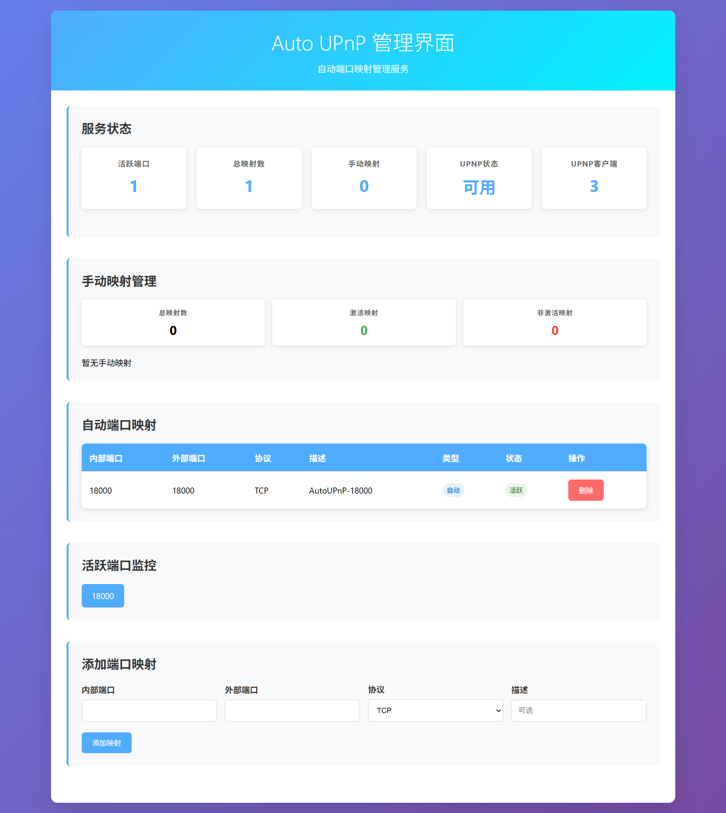

# Auto UPnP - 智能端口映射神器，让内网穿透变得简单！

> 还在为端口映射烦恼吗？还在手动配置路由器端口转发吗？今天给大家推荐一个神器 - Auto UPnP，让你的端口映射自动化！

## 🎯 功能介绍

### 什么是 Auto UPnP？

Auto UPnP 是一个用 Go 语言开发的高性能自动端口映射服务，它能够：

- **🔍 智能端口监控**：自动监控指定端口范围的上下线状态
- **🔄 自动UPnP映射**：根据端口状态自动添加/删除路由器端口映射
- **🌐 现代化Web界面**：提供美观的管理界面，支持手机和电脑访问
- **🔐 安全认证**：用户名密码保护，确保管理界面安全
- **📱 响应式设计**：完美支持手机、平板、电脑访问
- **⚡ 实时更新**：每5秒自动刷新状态，数据实时同步

### 主要应用场景

1. **游戏服务器**：Minecraft、CS2、LOL等游戏服务器自动端口映射
2. **Web服务**：个人网站、API服务、开发环境端口映射
3. **媒体服务**：Plex、Emby、Jellyfin等媒体服务器
4. **开发调试**：本地开发环境端口映射到外网
5. **远程访问**：SSH、RDP、VNC等远程服务端口映射

### 核心优势

- **零配置**：安装后自动发现UPnP设备，无需手动配置
- **智能化**：端口上线自动映射，下线自动删除，无需人工干预
- **持久化**：手动添加的映射自动保存，重启后自动恢复
- **可视化**：Web界面实时显示端口状态和映射情况
- **高性能**：Go语言开发，资源占用低，响应速度快

## ⚠️ 安装前提

### 必须条件

**🚨 重要提醒：使用 Auto UPnP 必须满足以下条件！**

1. **支持UPnP的路由器**
   - 路由器必须支持UPnP（通用即插即用）功能
   - 路由器UPnP功能必须已启用
   - 常见支持UPnP的路由器品牌：华硕、网件、TP-Link、小米、华为等

2. **网络环境**
   - 设备必须连接到支持UPnP的路由器
   - 防火墙不能阻止UPnP通信（端口1900）
   - 网络连接正常

### 如何检查路由器是否支持UPnP？

#### 方法一：查看路由器管理界面
1. 登录路由器管理界面（通常是 192.168.1.1 或 192.168.0.1）
2. 查找"UPnP"、"通用即插即用"或"端口映射"选项
3. 确保UPnP功能已启用

#### 方法二：使用命令行检查
```bash
# Linux/macOS
sudo nmap -p 1900 192.168.1.1

# 如果看到以下输出，说明支持UPnP
# 1900/tcp open  upnp
```

#### 方法三：使用在线工具
访问 https://www.upnp.org/ 查看路由器是否在支持列表中

### 系统要求

- **操作系统**：Linux、macOS、Windows
- **Go版本**：1.21 或更高版本（仅开发环境需要）
- **网络权限**：需要网络访问权限
- **存储空间**：至少 50MB 可用空间

## 🚀 安装教程

### 方式一：一键安装（推荐）

这是最简单的安装方式，适合大多数用户：

```bash
# 下载并运行安装脚本
curl -fsSL https://raw.githubusercontent.com/your-username/auto-upnp/main/install.sh | sudo bash
```

安装脚本会自动完成：
- ✅ 下载最新版本
- ✅ 生成配置文件
- ✅ 创建系统服务
- ✅ 设置开机自启
- ✅ 启动服务

### 方式二：手动安装

适合喜欢手动控制的用户：

```bash
# 1. 克隆项目
git clone https://github.com/your-username/auto-upnp.git
cd auto-upnp

# 2. 构建项目
./build-static.sh

# 3. 安装到系统
sudo cp build/auto-upnp-static /usr/local/bin/auto-upnp

# 4. 创建配置目录
sudo mkdir -p /etc/auto-upnp

# 5. 复制配置文件
sudo cp config.yaml /etc/auto-upnp/config.yaml

# 6. 创建systemd服务
sudo tee /etc/systemd/system/auto-upnp.service > /dev/null <<EOF
[Unit]
Description=Auto UPnP Service
After=network.target

[Service]
Type=simple
User=root
ExecStart=/usr/local/bin/auto-upnp -config /etc/auto-upnp/config.yaml
Restart=always
RestartSec=5

[Install]
WantedBy=multi-user.target
EOF

# 7. 启动服务
sudo systemctl daemon-reload
sudo systemctl enable auto-upnp
sudo systemctl start auto-upnp
```

### 方式三：Docker安装

适合Docker用户：

```bash
# 创建配置目录
mkdir -p ~/auto-upnp/config

# 下载配置文件
curl -o ~/auto-upnp/config/config.yaml https://raw.githubusercontent.com/your-username/auto-upnp/main/config.yaml

# 运行容器
docker run -d \
  --name auto-upnp \
  --network host \
  --restart unless-stopped \
  -v ~/auto-upnp/config:/etc/auto-upnp \
  your-username/auto-upnp:latest
```

## 🔧 配置说明

### 默认配置

安装完成后，默认配置文件位于 `/etc/auto-upnp/config.yaml`：

```yaml
# 端口监听范围（可根据需要修改）
port_range:
  start: 18000      # 起始端口
  end: 19000        # 结束端口
  step: 1           # 端口间隔

# 管理界面配置
admin:
  enabled: true             # 启用Web管理界面
  host: "0.0.0.0"          # 监听地址
  port: 8080               # 监听端口
  username: "admin"         # 用户名
  password: "admin"         # 密码

# UPnP配置
upnp:
  discovery_timeout: 10s    # 设备发现超时
  mapping_duration: 1h      # 映射持续时间
  retry_attempts: 3         # 重试次数
```

### 重要配置说明

1. **端口范围**：根据你的应用需求设置监控的端口范围
2. **管理界面**：可以修改默认的用户名和密码
3. **映射持续时间**：设置为0表示永久映射，设置为时间表示临时映射

## 📱 使用教程

### 1. 访问管理界面

安装完成后，打开浏览器访问：
```
http://localhost:8080
```

如果8080端口被占用，服务会自动选择下一个可用端口，查看日志获取实际端口：
```bash
sudo journalctl -u auto-upnp -f
```

### 2. 登录认证

使用默认认证信息登录：
- **用户名**：admin
- **密码**：admin

> 💡 建议首次登录后修改默认密码

### 3. 查看服务状态

登录后可以看到：
- 📊 服务运行状态
- 🔢 活跃端口数量
- 📈 端口映射统计
- 🌐 UPnP设备状态

### 4. 管理端口映射

#### 自动映射
- 当检测到端口上线时，会自动添加UPnP映射
- 当检测到端口下线时，会自动删除UPnP映射
- 无需人工干预

#### 手动映射
- 点击"添加映射"按钮
- 填写内部端口、外部端口、协议类型
- 添加描述信息
- 点击确认添加

### 5. 监控端口状态

- 实时查看所有监控端口的活跃状态
- 支持端口状态筛选和搜索
- 每5秒自动刷新数据

## 📸 截图预览

### 主界面



主界面提供了完整的服务状态概览，包括：
- 📊 **服务状态监控**：实时显示服务运行状态
- 🔢 **端口统计**：显示活跃端口数量、总映射数等
- 📈 **映射管理**：区分自动映射和手动映射
- 🌐 **UPnP状态**：显示UPnP设备连接状态
- ⚡ **实时更新**：每5秒自动刷新数据

## 🔧 服务管理

### 启动/停止服务
```bash
# 启动服务
sudo systemctl start auto-upnp

# 停止服务
sudo systemctl stop auto-upnp

# 重启服务
sudo systemctl restart auto-upnp

# 查看状态
sudo systemctl status auto-upnp
```

### 查看日志
```bash
# 查看实时日志
sudo journalctl -u auto-upnp -f

# 查看最近100行日志
sudo journalctl -u auto-upnp -n 100

# 查看错误日志
sudo journalctl -u auto-upnp -p err
```

### 开机自启
```bash
# 启用开机自启
sudo systemctl enable auto-upnp

# 禁用开机自启
sudo systemctl disable auto-upnp
```

## 🐛 常见问题

### Q1: 无法发现UPnP设备
**A**: 请检查：
- 路由器是否支持UPnP功能
- 路由器UPnP设置是否已启用
- 防火墙是否阻止了UPnP通信
- 网络连接是否正常

### Q2: 端口映射失败
**A**: 可能原因：
- 端口已被其他服务占用
- 路由器UPnP功能异常
- 网络环境不支持UPnP
- 查看日志获取详细错误信息

### Q3: Web界面无法访问
**A**: 检查：
- 服务是否正在运行
- 端口是否被占用（查看日志获取实际端口）
- 防火墙设置
- 认证信息是否正确

### Q4: 服务启动失败
**A**: 检查：
- 配置文件格式是否正确
- 端口范围设置是否合理
- 系统权限是否足够
- 查看日志获取错误信息

## 🎉 总结

Auto UPnP 是一个非常实用的端口映射工具，特别适合：

- 🎮 **游戏玩家**：自动管理游戏服务器端口映射
- 👨‍💻 **开发者**：简化开发环境的端口映射
- 🏠 **家庭用户**：管理家庭媒体服务器和智能设备
- 🏢 **小型企业**：简化网络服务管理

### 主要优势
- ✅ **零配置**：安装即用，无需复杂配置
- ✅ **智能化**：自动检测端口状态，自动管理映射
- ✅ **可视化**：现代化Web界面，操作简单直观
- ✅ **高性能**：Go语言开发，资源占用低
- ✅ **跨平台**：支持Linux、macOS、Windows

### 立即体验
如果你还在为端口映射烦恼，不妨试试 Auto UPnP，让端口映射变得简单智能！

**项目地址**：https://github.com/your-username/auto-upnp

**一键安装**：
```bash
curl -fsSL https://raw.githubusercontent.com/your-username/auto-upnp/main/install.sh | sudo bash
```

---

*如果你觉得这个工具有用，请给个⭐️支持一下！有任何问题或建议，欢迎在评论区讨论。* 