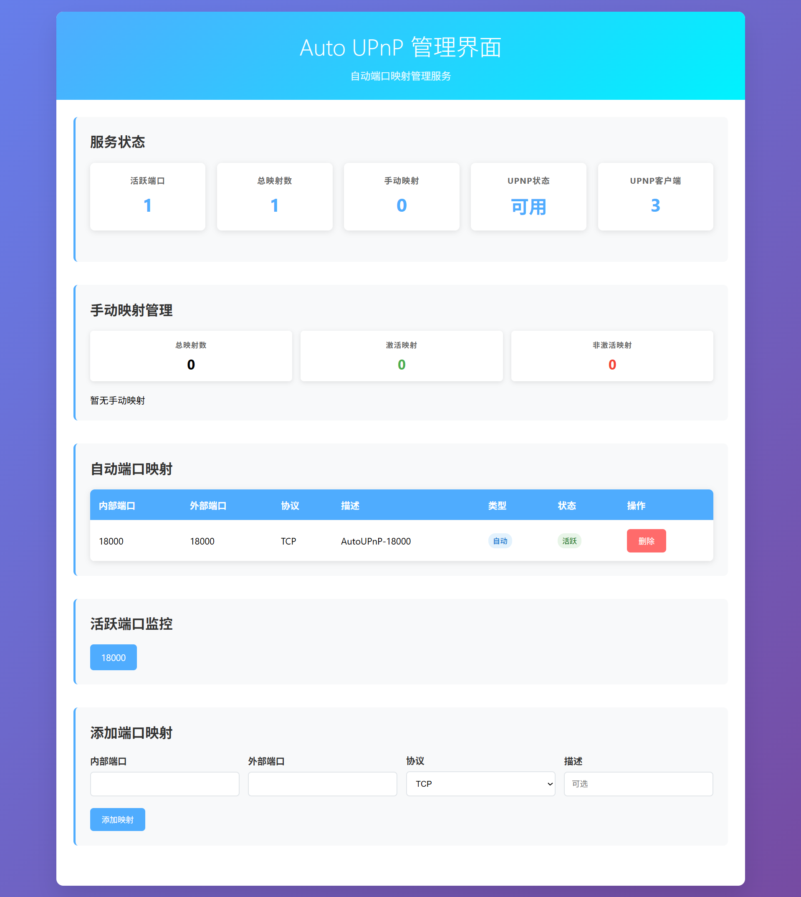

# Auto UPnP - 自动UPnP端口映射服务

[](https://golang.org)
[](LICENSE)
[]()

一个用Go语言编写的高性能自动UPnP端口映射服务，能够智能监控端口状态并自动管理UPnP端口映射，提供现代化的Web管理界面。

## ✨ 主要特性

### 🔍 智能端口监控
- **自动端口检测**: 监控指定端口范围的上下线状态
- **实时状态更新**: 毫秒级响应端口状态变化
- **多协议支持**: 同时支持TCP和UDP协议监控
- **智能重试机制**: 自动重试失败的端口检测

### 🔄 自动UPnP映射管理
- **智能映射**: 根据端口状态自动添加/删除UPnP端口映射
- **映射持久化**: 自动保存手动映射，服务重启后自动恢复
- **映射清理**: 定期清理过期和无效的端口映射
- **映射限制**: 可配置最大映射数量，防止资源耗尽

### 🌐 现代化Web管理界面
- **响应式设计**: 支持桌面和移动设备访问
- **实时数据更新**: 每5秒自动刷新状态信息
- **可视化监控**: 图形化显示端口活跃状态和映射情况
- **RESTful API**: 提供完整的API接口支持程序化操作

### 🔐 安全与认证
- **基本认证**: 用户名密码保护管理界面
- **HTTPS支持**: 可配置SSL证书支持安全访问
- **访问控制**: 可限制管理界面访问IP地址
- **日志审计**: 完整的操作日志记录

### ⚙️ 灵活配置
- **YAML配置**: 人性化的配置文件格式
- **热重载**: 支持运行时配置更新
- **多环境支持**: 开发、测试、生产环境配置分离
- **网络接口选择**: 支持指定优先和排除的网络接口

## 🚀 快速开始

### 系统要求

- **操作系统**: Linux, macOS, Windows
- **Go版本**: 1.21 或更高版本
- **网络**: 支持UPnP的路由器
- **权限**: 需要网络访问权限

### 安装方式

#### 方式一：使用安装脚本（推荐）

```bash
# 一键安装
curl -fsSL https://raw.githubusercontent.com/your-username/auto-upnp/main/install.sh | sudo bash

# 或分步安装
wget https://raw.githubusercontent.com/your-username/auto-upnp/main/install.sh
chmod +x install.sh
sudo ./install.sh
```

安装脚本会自动完成：
- 下载最新release版本
- 生成默认配置文件到 `/etc/auto-upnp/config.yaml`
- 创建systemd服务文件
- 设置日志目录和权限

#### 方式二：手动安装

```bash
# 1. 克隆项目
git clone <repository-url>
cd auto-upnp

# 2. 安装依赖
go mod tidy

# 3. 构建项目（推荐静态编译）
./build-static.sh

# 4. 复制配置文件
cp config.yaml /etc/auto-upnp/config.yaml

# 5. 安装到系统
sudo cp build/auto-upnp-static /usr/local/bin/auto-upnp
```

#### 方式三：使用Makefile

```bash
# 安装依赖
make deps

# 静态构建（解决GLIBC版本问题）
make build-static

# 构建所有平台版本
make build-all

# 安装到系统
make install
```

### 配置说明

创建配置文件 `config.yaml`：

```yaml
# 端口监听范围配置
port_range:
  start: 18000      # 起始端口
  end: 19000        # 结束端口
  step: 1           # 端口间隔

# UPnP配置
upnp:
  discovery_timeout: 10s    # 设备发现超时时间
  mapping_duration: 1h      # 端口映射持续时间，0表示永久
  retry_attempts: 3         # 重试次数
  retry_delay: 5s           # 重试延迟

# 管理服务配置
admin:
  enabled: true             # 是否启用管理服务
  host: "0.0.0.0"          # 监听地址
  port: 8080               # 监听端口（自动选择可用端口）
  username: "admin"         # 用户名
  password: "admin"         # 密码
  data_dir: "data"          # 数据目录

# 网络接口配置
network:
  preferred_interfaces: ["eth0", "wlan0"]  # 优先使用的网络接口
  exclude_interfaces: ["lo", "docker"]     # 排除的网络接口

# 日志配置
log:
  level: "info"             # 日志级别: debug, info, warn, error
  format: "json"            # 日志格式: json, text
  file: "auto_upnp.log"     # 日志文件
  max_size: 10485760        # 最大文件大小 (10MB)
  backup_count: 5           # 备份文件数量

# 监控配置
monitor:
  check_interval: 30s       # 端口状态检查间隔
  cleanup_interval: 5m      # 清理无效映射间隔
  max_mappings: 100         # 最大端口映射数量
```

## 🎯 使用方法

### 服务管理

#### 使用systemd管理（推荐）

```bash
# 启动服务
sudo systemctl start auto-upnp

# 停止服务
sudo systemctl stop auto-upnp

# 重启服务
sudo systemctl restart auto-upnp

# 查看服务状态
sudo systemctl status auto-upnp

# 查看实时日志
sudo journalctl -u auto-upnp -f

# 开机自启动
sudo systemctl enable auto-upnp

# 禁用开机自启动
sudo systemctl disable auto-upnp
```

#### 手动运行

```bash
# 使用默认配置启动
./auto-upnp-static

# 指定配置文件
./auto-upnp-static -config /path/to/config.yaml

# 调试模式
./auto-upnp-static -log-level debug

# 显示帮助信息
./auto-upnp-static -help
```

### Web管理界面

服务启动后，通过浏览器访问管理界面：

#### 访问地址
```
http://localhost:8080
```
> **注意**: 如果8080端口被占用，服务会自动选择下一个可用端口

#### 登录认证
- **用户名**: admin
- **密码**: admin
> 可在配置文件中修改认证信息

#### 界面功能

##### 📊 服务状态监控
- 实时显示活跃端口数量
- 显示总映射数、自动映射数、手动映射数
- 监控服务运行状态和UPnP设备状态

##### 🔧 端口映射管理
- 查看所有端口映射列表
- 显示映射详细信息（内部端口、外部端口、协议、描述等）
- 支持删除现有映射
- 区分自动映射和手动映射

##### ➕ 手动端口映射
- 添加新的端口映射
- 支持TCP和UDP协议
- 可自定义映射描述
- 自动持久化保存

##### 📈 端口状态可视化
- 图形化显示所有监控端口的活跃状态
- 实时更新端口状态
- 支持端口状态筛选和搜索

#### API接口

管理界面提供完整的RESTful API：

```bash
# 获取服务状态
GET /api/status

# 获取端口映射列表
GET /api/mappings

# 添加端口映射
POST /api/add-mapping
Content-Type: application/json
{
  "internal_port": 8080,
  "external_port": 8080,
  "protocol": "TCP",
  "description": "Web服务"
}

# 删除端口映射
POST /api/remove-mapping
Content-Type: application/json
{
  "external_port": 8080,
  "protocol": "TCP"
}

# 获取端口状态
GET /api/ports

# 获取UPnP状态
GET /api/upnp-status
```

详细API文档请参考 [API_EXAMPLES.md](API_EXAMPLES.md)

## 🏗️ 项目架构

### 目录结构

```
auto-upnp/
├── cmd/
│   └── main.go                    # 主程序入口
├── config/
│   └── config.go                  # 配置管理
├── internal/
│   ├── admin/                     # Web管理界面
│   │   ├── admin.go              # HTTP服务器
│   │   └── templates.go          # HTML模板
│   ├── portmonitor/              # 端口监控
│   │   └── port_monitor.go       # 端口监控器
│   ├── service/                  # 核心服务
│   │   └── auto_upnp_service.go  # 自动UPnP服务
│   └── upnp/                     # UPnP管理
│       └── upnp_manager.go       # UPnP管理器
├── data/                         # 数据目录
├── config.yaml                   # 配置文件
├── manual_mappings.json          # 手动映射持久化
├── go.mod                        # Go模块文件
├── go.sum                        # 依赖校验文件
├── Makefile                      # 构建脚本
├── build.sh                      # 构建脚本
├── install.sh                    # 安装脚本
├── README.md                     # 项目说明
├── ADMIN_README.md               # 管理界面说明
├── API_EXAMPLES.md               # API使用示例
└── PORT_MONITOR_SEPARATION.md    # 端口监控分离说明
```

### 核心组件

#### 1. 端口监控器 (PortMonitor)
- 负责监控指定端口范围的状态变化
- 支持TCP和UDP协议检测
- 提供端口状态事件通知

#### 2. UPnP管理器 (UPnPManager)
- 负责UPnP设备发现和通信
- 管理端口映射的添加、删除和查询
- 处理UPnP协议相关的错误和重试

#### 3. 自动UPnP服务 (AutoUPnPService)
- 协调端口监控和UPnP管理
- 实现自动映射逻辑
- 管理手动映射的持久化

#### 4. Web管理界面 (Admin)
- 提供HTTP管理服务器
- 实现RESTful API接口
- 提供现代化的Web界面



主界面提供了完整的服务状态概览，包括：
- 📊 **服务状态监控**：实时显示服务运行状态
- 🔢 **端口统计**：显示活跃端口数量、总映射数等
- 📈 **映射管理**：区分自动映射和手动映射
- 🌐 **UPnP状态**：显示UPnP设备连接状态
- ⚡ **实时更新**：每5秒自动刷新数据


## 🔧 高级配置

### 网络接口配置

```yaml
network:
  preferred_interfaces: ["eth0", "wlan0"]  # 优先使用的网络接口
  exclude_interfaces: ["lo", "docker"]     # 排除的网络接口
```

### 日志配置

```yaml
log:
  level: "info"             # 日志级别
  format: "json"            # 日志格式
  file: "auto_upnp.log"     # 日志文件路径
  max_size: 10485760        # 最大文件大小 (字节)
  backup_count: 5           # 备份文件数量
```

### 监控配置

```yaml
monitor:
  check_interval: 30s       # 端口状态检查间隔
  cleanup_interval: 5m      # 清理无效映射间隔
  max_mappings: 100         # 最大端口映射数量
```

## 📝 手动映射持久化

### 文件格式

手动映射保存在 `manual_mappings.json` 文件中：

```json
[
  {
    "internal_port": 8080,
    "external_port": 8080,
    "protocol": "TCP",
    "description": "Web服务",
    "created_at": "2024-01-15T10:30:00Z"
  }
]
```

### 持久化特性

- **自动保存**: 每次添加或删除手动映射时自动更新文件
- **自动恢复**: 服务启动时自动加载并恢复所有手动映射
- **错误处理**: 恢复失败时记录警告但继续处理其他映射
- **文件位置**: 默认保存在程序运行目录下

## 🛠️ 开发指南

### 环境准备

```bash
# 克隆项目
git clone <repository-url>
cd auto-upnp

# 安装依赖
go mod tidy

# 运行测试
make test

# 代码格式化
make fmt

# 代码检查
make lint
```

### 构建选项

```bash
# 普通构建
make build

# 静态构建（解决GLIBC版本问题）
make build-static

# 兼容旧版本GLIBC
make build-compatible

# 构建所有平台
make build-all

# 运行服务
make run-static

# 调试模式运行
make run-debug
```

### 添加新功能

1. 在相应的包中添加新功能
2. 更新配置文件结构（如需要）
3. 添加测试用例
4. 更新文档

## 🐛 故障排除

### 常见问题

#### 1. GLIBC版本问题
```bash
# 错误信息
./auto-upnp: /lib/x86_64-linux-gnu/libc.so.6: version `GLIBC_2.34' not found

# 解决方案：使用静态编译
make build-static
```

#### 2. 无法发现UPnP设备
- 确保路由器支持UPnP功能
- 检查路由器UPnP设置是否启用
- 确认防火墙允许UPnP通信
- 检查网络连接状态

#### 3. 端口映射失败
- 检查路由器UPnP设置
- 确认端口未被其他服务占用
- 查看日志获取详细错误信息
- 检查端口范围配置

#### 4. 服务无法启动
- 检查配置文件格式是否正确
- 确认端口范围设置合理
- 查看系统权限和网络访问权限
- 检查日志文件获取错误信息

#### 5. Web界面无法访问
- 确认管理服务已启用
- 检查防火墙设置
- 验证访问地址和端口
- 确认认证信息正确

### 调试模式

使用debug日志级别获取详细信息：

```bash
./auto-upnp-static -log-level debug
```

### 日志分析

服务输出JSON格式日志，包含：
- 服务启动/停止信息
- UPnP设备发现过程
- 端口状态变化
- 端口映射操作
- 错误和警告信息

## 📦 卸载

### 使用安装脚本卸载

```bash
# 卸载服务
sudo ./install.sh --uninstall

# 或使用短选项
sudo ./install.sh -u
```

### 手动卸载

```bash
# 停止服务
sudo systemctl stop auto-upnp
sudo systemctl disable auto-upnp

# 删除文件
sudo rm -f /usr/local/bin/auto-upnp
sudo rm -f /etc/systemd/system/auto-upnp.service
sudo rm -rf /etc/auto-upnp

# 重新加载systemd
sudo systemctl daemon-reload
```

## 📄 许可证

本项目采用 [MIT License](LICENSE) 许可证。

## 🤝 贡献

欢迎提交Issue和Pull Request！

### 贡献指南

1. Fork 项目
2. 创建功能分支 (`git checkout -b feature/AmazingFeature`)
3. 提交更改 (`git commit -m 'Add some AmazingFeature'`)
4. 推送到分支 (`git push origin feature/AmazingFeature`)
5. 打开 Pull Request

## 📞 支持

如果您遇到问题或有建议，请：

1. 查看 [故障排除](#故障排除) 部分
2. 搜索现有的 [Issues](../../issues)
3. 创建新的 Issue 并详细描述问题

## 📈 更新日志

### v1.0.0 (2024-01-15)
- 🎉 初始版本发布
- ✨ 支持自动端口监控和UPnP映射
- 🌐 提供现代化Web管理界面
- 🔐 实现安全认证和API接口
- 📝 完整的配置管理和日志系统
- 🛠️ 支持手动映射持久化
- 📦 提供一键安装脚本

---

**Auto UPnP** - 让端口映射变得简单智能！ 🚀 